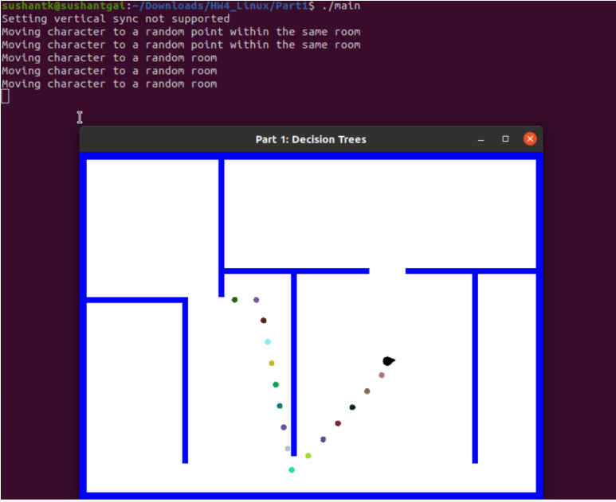
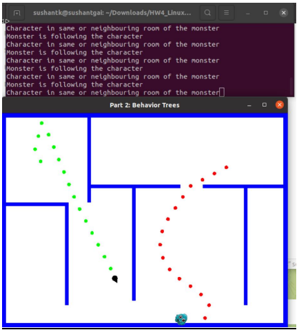
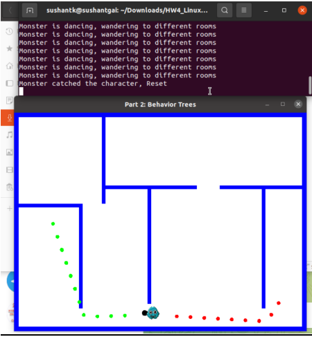
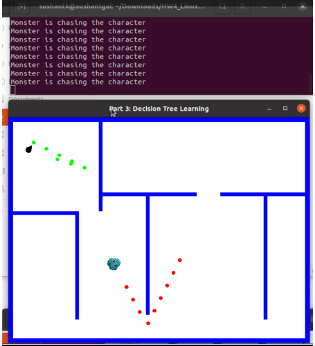
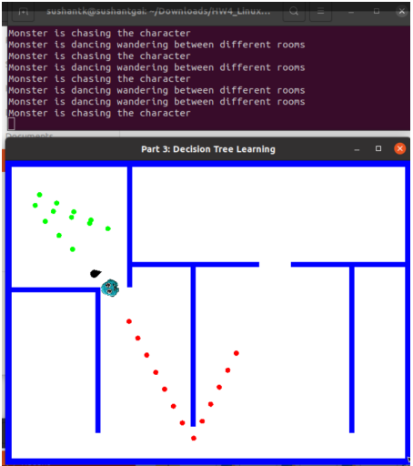

# Game AI: Decision and Behavior Trees in C++

## Project Overview

This project was part of my **CSC 584: Building Game AI** class in Spring 2024 at North Carolina State University. The primary focus was to implement AI decision-making and learning algorithms in a game environment using **C++** and **SFML**. The project explored decision trees, behavior trees, and decision tree learning, applied to character movement and pathfinding within a game simulation.

The key components of the project include:

- **Decision Trees**: Used for controlling the movement and target behavior of game characters based on environmental parameters.
- **Behavior Trees**: Implemented for a monster AI that chases, dances, and wanders in the environment, showcasing sequential decision-making through composite nodes.
- **Decision Tree Learning**: Leveraged machine learning techniques to replicate and optimize the behavior of the monster AI by learning from behavior tree data.

## Features

1. **Character Movement and Pathfinding**: Integrated with the algorithms from previous assignments (HW2 and HW3) to implement movement and decision-making behaviors.
2. **Decision Trees**:
   - Developed a decision tree from scratch to control when and how the character changes its movement behavior based on factors like proximity to walls, target locations, and elapsed time.
   - Dynamically altered character movement behaviors like wandering, pathfinding, and avoiding obstacles.
3. **Behavior Trees**:
   - Structured a behavior tree with composite nodes (Sequence, Selector, and Decorators) for monster AI behaviors.
   - The monster can chase the player, perform a dance, and avoid walls while wandering.
4. **Decision Tree Learning**:
   - Implemented the ID3 algorithm to learn decision trees from monster AI data.
   - Used a dataset of 10,000 samples to train a decision tree that mirrors the behavior of the original behavior tree-controlled monster.
   - Demonstrated performance improvements with learned decision trees in terms of chasing efficiency.

## Project Setup

### Prerequisites

- **Ubuntu 20.04**
- **C++ Compiler**
- **SFML Library**

## Directory Structure

The project is organized into three parts, each corresponding to a different phase of the assignment:

- **Part1**: Contains the code for the decision tree implementation.
- **Part2**: Contains the code for the behavior tree implementation.
- **Part3**: Contains the final implementation with decision tree learning.

### Compilation and Execution

1. Clone the repository:
   ```bash
   git clone https://github.com/your-username/Game-AI-Decision-Behavior-Trees.git
   cd Game-AI-Decision-Behavior-Trees
   ```
2. Ensure that you have **SFML** installed. If not, you can install it using:
   ```bash
   sudo apt-get install libsfml-dev
   ```
3. To run the final version of the application, follow these steps:
   3.1 Navigate to the **Part3** directory, which contains the complete code:
   ```bash
   cd Part3
   ```
   3.2 Compile the project using the provided `Makefile`:
   ```bash
   make
   ```
   3.3 Run the executable:
   ```bash
   ./main
   ```

## Screenshots of the Application







## What I Learned

- **C++ Proficiency**: This project enhanced my ability to write modular, efficient, and optimized C++ code for game AI applications.
- **Decision and Behavior Trees**: I deepened my understanding of decision-making algorithms, particularly how to model complex behaviors with simple decision structures and optimize AI performance.
- **Machine Learning Integration**: I learned how to integrate decision tree learning to mimic behavior tree-based decision-making, highlighting the role of machine learning in improving AI behaviors.
- **Game AI Design**: Designing flexible, scalable AI systems that can handle multiple behaviors and conditions simultaneously was a key takeaway from this project.

## Conclusion

This project provided hands-on experience with implementing game AI in C++ and demonstrated how traditional decision-making algorithms can be enhanced through machine learning techniques. The knowledge and skills gained from this project will be instrumental in my future work in AI, game development, and software engineering.

## Credits

This project was done as part of **CSC 584: Building Game AI** in Spring 2024, instructed by Dr. David L Roberts at North Carolina State University.

---
